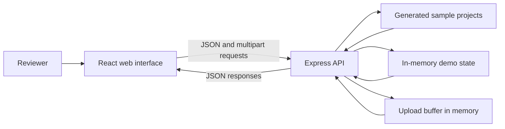

# MPLADS AI Monitoring Demo

A prototype dashboard for exploring MPLADS-style project data, risk indicators, and audit-review workflows.

## Live Demo

[Open the application](http://13.48.137.1:3000/)

> The demo is served over HTTP and uses sample data and demo accounts. Do not submit real, confidential, or personal information, or reuse a password you use elsewhere.

## Key Concepts

- **Project monitoring:** Browse projects, financial summaries, completion status, locations, alerts, and risk levels in one interface.
- **Risk triage:** Use anomaly and risk indicators to prioritize records for human review; the indicators are not findings of fraud or wrongdoing.
- **Audit follow-up:** Keep review status, notes, evidence checklist items, and audit cases alongside project records.
- **Dataset review:** Submit CSV or Excel files through the demo upload flow and view inspection and analysis responses.
- **Role-based views:** Explore screens for ministry, state, district, and MP demo roles.

## Data Flow

The browser loads the React application and calls the Express API from the same Node.js service. Project pages request dashboard, project, alert, and audit data. Uploads are sent as multipart requests and held in memory by the server; the demo returns API responses for the inspection and analysis flow. This is a prototype flow, not a production ETL pipeline.

## Data Architecture

- **Presentation:** React and TypeScript pages, with Vite serving the client during development and the built `dist` files in production.
- **Application/API:** An Express server in `server.ts` serves the UI and `/api/*` endpoints on port `3000`.
- **Demo data:** Project records are generated in code. Mutable demo state and uploaded file buffers are kept in process memory; there is no database in this repository, and state can reset when the server restarts.
- **External systems:** The demo does not connect to official MPLADS portals, government databases, or identity systems.

## How It Differs from a Conventional Review Workflow

Review processes vary across government departments and jurisdictions. Where records, prioritization, and follow-up are handled across separate reports or tools, this prototype is designed to bring them together:

| Review activity | Prototype approach |
| --- | --- |
| Find a project across reports | Searchable project register with location, status, and financial context |
| Decide what needs attention | Risk and anomaly indicators, alerts, and data-quality signals for triage |
| Track evidence and follow-up | Project-linked review status, notes, checklist, and audit cases |
| Compare portfolio patterns | Dashboard summaries and agency, risk, and reconciliation views |

This is a description of the prototype's intended workflow, not an assessment of every existing government process. The application is not an official government system, does not replace statutory review, and requires validation and authorization before any operational use.

## Limitations and Safe Use

- Treat risk scores, anomaly flags, and duplicate candidates as prompts for investigation. Verify them against source documents.
- The current server uses generated sample projects and in-memory demo state; it is not a persistent production data platform.
- The public URL uses unencrypted HTTP. Do not enter sensitive data or credentials.